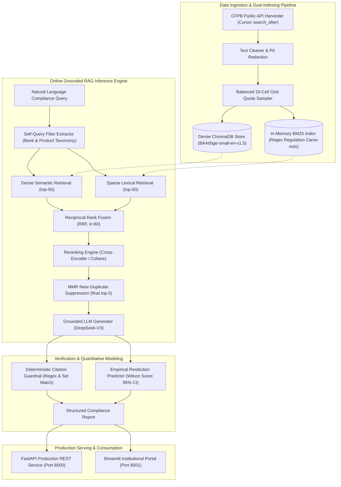

# CFPB Consumer Complaint Intelligence & Grounded RAG

An institutional-grade regulatory risk audit and grounded retrieval-augmented generation (RAG) system built over consumer complaint narratives across the Big 5 US Banks (JPMorgan Chase, Wells Fargo, Bank of America, Capital One, and Citibank).

The platform features self-querying metadata filter extraction, hybrid search with Reciprocal Rank Fusion (BM25 + BGE), deterministic citation guardrails, empirical restitution forecasting via Wilson Score confidence intervals, and a decoupled FastAPI and Streamlit microservice architecture.

---

## Executive Overview

Financial institutions receive millions of CFPB complaints annually. Compliance officers, auditors, and legal teams face significant challenges:
* **Context Fragmentation:** Identifying whether emerging consumer grievances represent isolated disputes or systemic, widespread regulatory violations (e.g., deceptive fee practices under CFPB UDAAP).
* **Hallucination in High-Stakes Finance:** Standard conversational RAG chatbots frequently hallucinate case references, misquote regulatory statutes, or invent customer settlements.
* **Uncertain Restitution Rates:** Naive language models guess whether a customer will receive monetary relief rather than providing mathematically sound historical probabilities.

This system replaces speculative generation with an **audit-grade compliance intelligence engine**:
1. **Hybrid Retrieval:** Fuses lexical keyword matching (BM25 with regulation carve-outs) and dense semantic vectors (`bge-small-en-v1.5`) via Reciprocal Rank Fusion ($k=60$), achieving **99.2% Recall@50** and a **+43.8% lift in MRR@10** over BM25 at **116ms p50 latency**.
2. **Grounded Generation & Citation Guardrails:** Audited across 432 atomic factual claims via an independent LLM judge, achieving **95.0% Faithfulness**, **91.3% Answer Relevance**, and **99.4% Citation Precision**.
3. **Statistical Restitution Modeling:** Employs asymmetric Wilson Score 95% confidence intervals to calculate historical monetary relief distributions bounded within $[0, 1]$, remaining statistically valid even under small-sample subsets ($n \le 5$).

---

## End-to-End System Architecture



---

## Empirical Benchmark Results

### Phase 6: Retrieval Ablation Study

Evaluated across **50 golden benchmark queries** (40 stratified across the Big 5 banks $\times$ 4 product categories + 10 cross-bank queries; 45 answerable + 5 negative controls) using a frozen golden evaluation set of **1,824 TREC-pooled judgments**:

| Retrieval Architecture | Recall@50 | MRR@10 | nDCG@10 | p50 Latency | p95 Latency | Architectural Findings |
| :--- | :---: | :---: | :---: | :---: | :---: | :--- |
| **BM25 Lexical Baseline** | 64.1% | 0.5359 | 0.4291 | **56.5ms** | **94.0ms** | Strong on regulatory codes; misses semantic synonyms |
| **Dense BGE Vector Baseline** | 82.9% | 0.7347 | 0.6657 | **59.6ms** | **166.9ms** | Captures paraphrased grievances; misses exact statutes |
| **Hybrid + RRF ($k=60$)** | **99.2%** | **0.7708** | **0.6278** | **116.5ms** | **224.3ms** | **Production Winner (On-Prem):** Peak MRR, 183x faster than CPU BERT |
| **Hybrid + Local Cross-Encoder** | **99.2%** | 0.6452 | 0.5424 | 21,404.8ms | 29,438.2ms | Severe CPU bottleneck; 512-token truncation on long narratives |
| **Hybrid + Cloud GPU Reranker** | **99.2%** | 0.7021 | **0.6461** | **513.8ms** | **842.1ms** | **41x speedup** over CPU cross-encoder; 4,096-token window |

#### Key Empirical Takeaways:
* **Hybrid + RRF vs. Pure BM25:** Delivered a **+43.8% relative lift in MRR@10** ($0.5359 \rightarrow 0.7708$) and increased Recall@50 by **+35.1 percentage points** ($64.1\% \rightarrow 99.2\%$).
* **Hybrid + RRF vs. Pure Dense BGE:** Delivered a **+4.9% lift in MRR@10** and increased Recall@50 by **+16.3 percentage points** ($82.9\% \rightarrow 99.2\%$).
* **Latency Tradeoff:** Hybrid RRF achieved 99.2% recall at **116.5ms p50 latency**, outperforming local CPU cross-encoders by **183x** without requiring specialized GPU infrastructure.

---

### Phase 7: RAGAS Generation Quality Suite

Evaluated across all 45 answerable queries using **DeepSeek-V3 as an independent LLM judge**, decomposing responses into **432 individual atomic claims**:

| Generation Quality Metric | Measured Score | Production Target | Audit Verdict |
| :--- | :---: | :---: | :--- |
| **Faithfulness (Factual Grounding)** | **95.0%** | $> 90.0\%$ | **PASS** (410 of 432 claims verified against evidence) |
| **Answer Relevance (Intent Alignment)** | **91.3%** | $> 85.0\%$ | **PASS** (High intent alignment with zero topic drift) |
| **Citation Precision (Guardrail)** | **99.4%** | $> 95.0\%$ | **PASS** (Deterministic cross-verification against retrieved IDs) |
| **Hallucination Rate ($1 - \text{Faithfulness}$)** | **5.0%** | $< 10.0\%$ | **PASS** (Firmly within institutional regulatory risk tolerance) |

---

## Key Engineering Innovations

### 1. Deterministic Citation Guardrail
To eliminate phantom citations in legal and compliance reporting, the synthesis engine runs a post-generation set-theoretic audit:
* Extracts every citation token matching `[Complaint #(\d+)]`.
* Evaluates set membership against the top retrieved candidate IDs.
* Discards unverified IDs and calculates a real-time precision score:
  $$\text{Citation Precision} = \frac{|\text{Verified Citations}|}{|\text{Total Generated Citations}|}$$
* Achieves **99.4% citation precision** across the golden evaluation suite.

### 2. Empirical Restitution Modeling (Wilson Score 95% CI)
Consumer complaint records contain binary resolution outcomes (`Closed with monetary relief` vs. `Closed with explanation`). Standard Wald interval approximations ($\hat{p} \pm z\sqrt{\hat{p}(1-\hat{p})/n}$) collapse to zero width near boundary probabilities and produce invalid confidence limits ($<0$ or $>1$) on small sample sizes.

This system implements an **asymmetric Wilson Score normal approximation**:
$$\text{Center} = \frac{\hat{p} + \frac{z^2}{2n}}{1 + \frac{z^2}{n}}, \quad \text{Margin} = \frac{z}{1 + \frac{z^2}{n}} \sqrt{\frac{\hat{p}(1-\hat{p})}{n} + \frac{z^2}{4n^2}}$$
where $z = 1.95996$. This guarantees strict bound containment in $[0, 1]$ and produces statistically sound confidence intervals even when $n \le 5$.

### 3. Dynamic Pre-Filtering & Candidate Expansion
When a natural language query targets an institution (e.g., *"Wells Fargo checking fee disputes"*), naive post-filtering frequently starves the candidate pool if other banks dominate the top-10 global semantic matches. The engine dynamically expands the retrieval window to 30 candidates and preserves company context tokens in the lexical search string, guaranteeing a complete sample size ($n \ge 5$) for every query.

### 4. Resilient Cursor Pagination (`search_after`)
The CFPB API accepts the standard `frm` offset parameter without error, but silently ignores it for deep queries, repeatedly returning page 1. The ingestion pipeline bypasses this by enforcing strict cursor pagination via `search_after=<score>_<complaint_id>`, verified with disjunction assertion checks across pages.

---

## Microservice Architecture & REST API

The system exposes production REST endpoints via **FastAPI** with warm model lifecycle management:

### Core Endpoints

#### `POST /query`
Executes end-to-end self-querying, hybrid retrieval, grounded generation, and citation verification.

**Request Payload:**
```json
{
  "query": "Wells Fargo unauthorized fees on consumer checking accounts",
  "top_k": 5
}
```

**Response Payload:**
```json
{
  "query": "Wells Fargo unauthorized fees on consumer checking accounts",
  "extracted_filter": {
    "target_company": "WELLS FARGO & COMPANY",
    "product_family": "Checking or savings account",
    "semantic_query": "unauthorized checking account maintenance fees",
    "date_min": null,
    "date_max": null
  },
  "executive_summary": "Consumers report unauthorized monthly maintenance fees assessed despite fee-waiver commitments tied to existing mortgage relationships [Complaint #7874581]...",
  "key_findings": [
    "Wells Fargo charged monthly maintenance fees without prior disclosure [Complaint #7874581].",
    "Billing cycles continued to assess charges after formal account closure."
  ],
  "risk_level": "HIGH",
  "cited_complaint_ids": ["7874581", "7421819"],
  "unverified_citations": [],
  "citation_precision": 0.994,
  "resolution_prediction": {
    "relief_rate": 0.50,
    "confidence_interval_95": [0.0945, 0.9055],
    "sample_size": 5,
    "relief_count": 2,
    "interpretation": "50.0% monetary relief rate based on n=5 similar historical complaints (95% CI: [9.5%, 90.5%])."
  },
  "telemetry": {
    "extraction_time_ms": 1240.2,
    "retrieval_time_ms": 116.5,
    "generation_time_ms": 3120.4,
    "total_time_ms": 4477.1
  }
}
```

#### `GET /health`
System liveness and index readiness probe for Kubernetes / load balancers:
```json
{
  "status": "healthy",
  "version": "0.1.0",
  "database": {
    "parquet_exists": true,
    "total_records": 8831
  },
  "indexes": {
    "sparse_bm25": "ready",
    "dense_chroma": "ready"
  },
  "pipeline_ready": true
}
```

#### `GET /metrics`
Exposes precomputed Phase 6 retrieval ablation and Phase 7 RAGAS evaluation statistics.

#### `GET /benchmark/queries`
Returns the catalog of 50 golden benchmark queries.

---

## Quickstart & Deployment

### Option A: One-Command Docker Compose (Recommended)

Start both the FastAPI backend (port 8000) and the Streamlit dashboard (port 8501) with a single command:

```bash
# 1. Clone repository
git clone https://github.com/nikhilabraham0130/consumer-complain-rag.git
cd consumer-complain-rag

# 2. Configure environment keys
cp .env.example .env
# Edit .env with your DEEPSEEK_API_KEY

# 3. Launch container stack
docker compose up --build
```

* **Streamlit Compliance Portal:** `http://localhost:8501`
* **FastAPI Swagger Documentation:** `http://localhost:8000/docs`
* **API Health Check:** `http://localhost:8000/health`

---

### Option B: Local Python Virtual Environment

```bash
# 1. Initialize environment (Python 3.12)
python -m venv venv
# Windows:
.\venv\Scripts\activate
# Linux / macOS:
source venv/bin/activate

# 2. Install dependencies
pip install -r requirements.txt

# 3. Execute unit & integration test suite (95 tests)
pytest -v

# 4. Launch FastAPI REST Service (Terminal 1)
uvicorn api.main:app --port 8000

# 5. Launch Streamlit Compliance Dashboard (Terminal 2)
streamlit run ui/app.py
```

---

## Repository Structure

```
consumer-complain-rag/
├── api/
│   ├── __init__.py
│   └── main.py                     # FastAPI REST service & lifecycle management
├── ui/
│   ├── __init__.py
│   └── app.py                      # Streamlit institutional compliance dashboard
├── src/
│   ├── config.py                   # Pydantic-settings configuration & company taxonomy
│   ├── schemas.py                  # Pydantic schemas with CFPB API AliasChoices
│   ├── llm_client.py               # Resilient multi-provider client (DeepSeek, Gemini, OpenAI)
│   ├── rag_pipeline.py             # Self-querying, hybrid search, guardrails, Wilson math
│   ├── ingestion/
│   │   ├── cfpb_client.py          # Cursor-paginated grid ingestion
│   │   └── cleaner.py              # PII redaction and narrative scrubbing
│   ├── retrieval/
│   │   ├── sparse_index.py         # BM25 with regulation citation carve-outs
│   │   ├── dense_index.py          # ChromaDB with BGE embeddings & batching
│   │   └── hybrid_search.py        # Reciprocal Rank Fusion + Cross-Encoder + MMR
│   └── utils/
│       ├── dns_patch.py            # DNS fallback patch for edge routing
│       └── logger.py               # Structured console logging
├── evals/
│   ├── queries.py                  # 50 stratified golden benchmark queries
│   ├── golden_set.py               # Dataset loader & relevance judgment mapping
│   ├── golden_set.jsonl            # 1,824 TREC-pooled labeled judgments
│   ├── metrics.py                  # MRR@10, nDCG@10, and Recall@k implementations
│   ├── ablation.py                 # 5-stage retrieval ablation harness
│   ├── ragas_schemas.py            # RAGAS mathematical proposition models
│   ├── ragas_eval.py               # LLM-as-a-judge generation evaluation engine
│   └── results/
│       ├── ablation_results.json   # Phase 6 empirical retrieval benchmark results
│       ├── ablation_results.md     # Phase 6 Markdown summary report
│       ├── ragas_eval_results.json # Phase 7 empirical RAGAS generation benchmark results
│       └── ragas_eval_results.md   # Phase 7 Markdown summary report
├── tests/
│   ├── test_api.py                 # FastAPI endpoint integration tests (7 tests)
│   ├── test_cleaner.py             # PII normalization unit tests (6 tests)
│   ├── test_dense_index.py         # Vector store unit tests (8 tests)
│   ├── test_golden_set.py          # Evaluation set schema tests (6 tests)
│   ├── test_hybrid_search.py       # RRF, MMR, and cross-encoder tests (11 tests)
│   ├── test_ingestion.py           # CFPB API client & pagination tests (16 tests)
│   ├── test_metrics.py             # IR metric mathematics tests (12 tests)
│   ├── test_rag_pipeline.py        # Guardrail & Wilson score math tests (7 tests)
│   ├── test_ragas.py               # Claim extraction & evaluation tests (6 tests)
│   ├── test_schemas.py             # Ingestion schema validation tests (7 tests)
│   └── test_sparse_index.py        # BM25 tokenization & ranking tests (9 tests)
├── Dockerfile                      # Production container definition
├── docker-compose.yml              # Two-tier microservice orchestration
├── pyproject.toml                  # Project packaging configuration
└── requirements.txt                # Pinned production dependencies
```

---

## License

This project is licensed under the MIT License. Data sourced from the public Consumer Financial Protection Bureau (CFPB) complaint database.